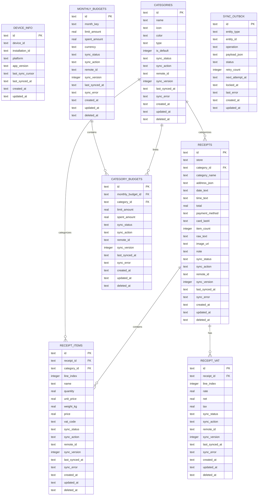

# Mobile Offline Database ERD

## Notes

- `monthly_budgets` stores one budget per month, using `month_key` like `2026-05`.
- `category_budgets` stores category-level limits inside a monthly budget.
- `sync_outbox` is intentionally generic. It can queue create/update/delete operations for any synced table using `entity_type` and `entity_id`.
- `device_info` is standalone because it identifies the local installation and sync cursor rather than business data.
