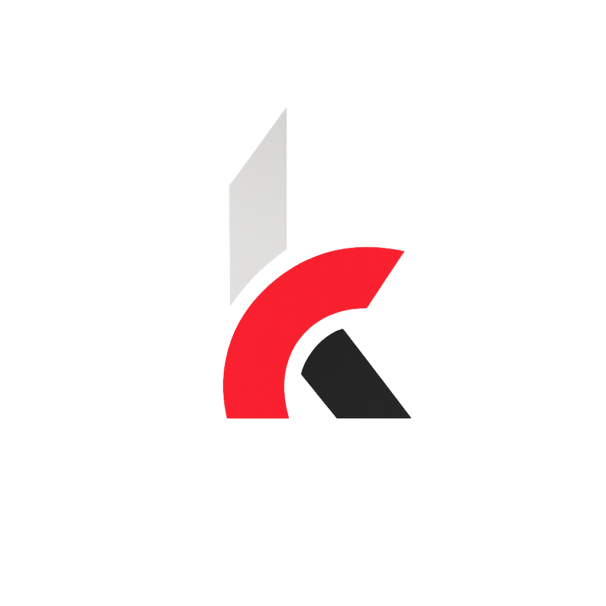

  
  <h1>Privacy Policy</h1>

Effective May 21, 2026

Klar Kasse helps you scan receipts, enter expenses, and track budgets. This Privacy Policy explains what data the app uses and how it is handled.

Klar Kasse is developed by saad16. Contact support is available inside the app from Settings > Customer Support.

## Overview

The app is designed to keep your spending records on your device unless you choose to send information through a support request or a configured sync feature.

## Data You Enter

You may enter a display name, currency, budget amounts, categories, receipts, receipt items, notes, merchant names, payment labels, and profile image choices.

This information is used to show your budgets, receipt history, insights, exports, and app preferences.

## Camera and Receipt Images

Klar Kasse asks for camera access so you can scan receipts. Receipt images are used to detect, crop, read, and review receipt details.

If you choose an existing receipt image, the app uses only the image you select. The app does not need broad photo or video library access for normal receipt scanning.

## Support Requests

If you contact support, the app may store and submit the name, email address, message, installation identifier, device information, platform, app version, and support status needed to respond to your request.

Support requests may stay pending on your device when support sync is not configured or the network is unavailable.

## Sharing and Sale of Data

Klar Kasse does not sell your personal data.

Klar Kasse does not use your receipt or budget data for advertising. Data is shared only when needed to provide a feature you use, such as submitting a support request.

## Storage, Deletion, and Export

Receipt, budget, category, preference, and support ticket records are stored locally in the app database on your device.

You can export monthly records from Your Data. You can delete monthly records in the app, and uninstalling the app removes local app data according to your device settings.

## Children

Klar Kasse is not directed to children. Do not use the app if you are not old enough to manage personal spending records in your region.

## Changes

This Privacy Policy may be updated as Klar Kasse changes. Updates will be published on this page.
